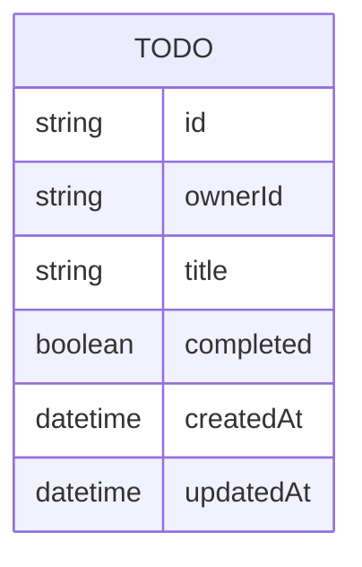

# Domain Model

A single entity carries the whole product: a Todo owned by exactly one
signed-in user (the user's identity comes from Thunder and is never stored as
its own row — every Todo simply carries the owner's subject id).

- `id` — server-generated identifier.
- `ownerId` — the signed-in user's subject id from the Thunder assertion; a
Todo is only ever read, edited, or deleted through its owner's own session.
- `title` — the only user-facing content field, per the PRD's deliberately
bare todo shape.
- `completed` — done / not-done status.
- `createdAt` / `updatedAt` — bookkeeping for the persisted record.

